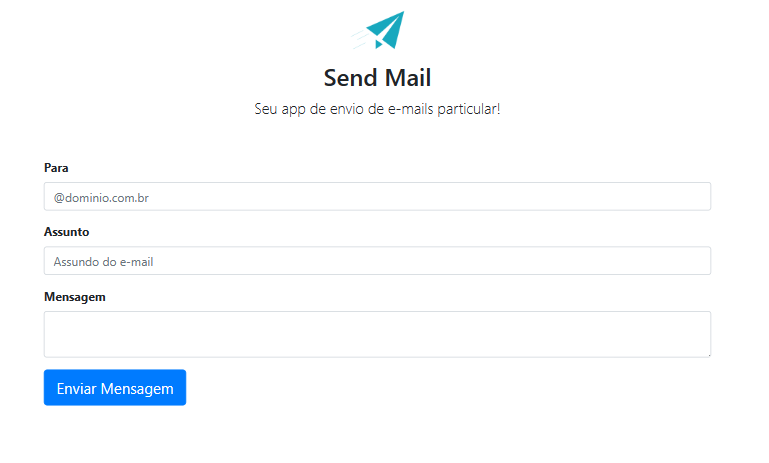

# <h1 align="center">App_Send_Email</h1>



App_Send_Email é uma aplicação PHP simples que utiliza a biblioteca PHPMailer para enviar emails. Esta aplicação fornece uma interface de usuário onde os usuários podem inserir o endereço de email do destinatário, o assunto e o corpo da mensagem, e então enviar o email.

## Recursos

- Envie emails facilmente usando a biblioteca PHPMailer.
- Interface de usuário simples para inserir o email do destinatário, assunto e mensagem.
- Fornece feedback sobre o envio bem-sucedido ou falha do email.

## Instalação

1. Clone o repositório para sua máquina local:

```bash
git clone https://github.com/paulovitorguedes/App_Send_Emai.git
```

2. Certifique-se de ter o PHP instalado em sua máquina.
3. Navegue até o diretório do projeto:
```bash
cd App_Send_Email
```
4. Inicie um servidor PHP local:
```bash
php -S localhost:8000
```

5. Abra seu navegador da web e visite http://localhost:8000 para acessar a aplicação.


## Uso
Na tela inicial, você encontrará campos de entrada para:
- Para: Insira o endereço de email do destinatário.
- Assunto: Insira o assunto do email.
- Mensagem: Insira o corpo do email.
- Clique no botão "Enviar Mensagem" para enviar o email.
- Se o email for enviado com sucesso, você receberá uma mensagem de sucesso.
Em caso de falha, uma mensagem de erro será exibida juntamente com logs detalhando a causa da falha.

## Dependências
PHPMailer: Uma classe completa para criação e transferência de emails em PHP.
Contribuição
Contribuições são bem-vindas! Sinta-se à vontade para abrir problemas ou enviar solicitações de pull.

## Licença
Este projeto está licenciado sob a Licença MIT - consulte o arquivo LICENSE para obter detalhes.

## Agradecimentos
Biblioteca PHPMailer por facilitar o envio de emails em PHP.


Sinta-se à vontade para personalizar este README conforme as especificidades do seu projeto! Se precisar de mais alguma coisa, estou à disposição.


